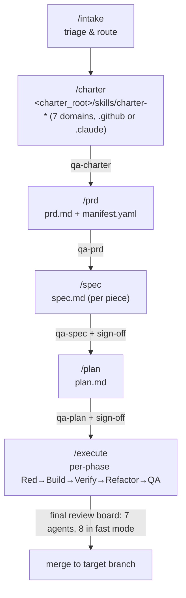

# spec-flow user guide

A walkthrough of the pipeline, the concepts that make it work, and the ten commands you'll use day-to-day.

For the "why this exists" pitch, see the **[What is spec-flow (and why)](../../../../README.md#what-is-spec-flow-and-why)** section on the repo root README. This guide assumes you're sold on the idea and want to learn how to drive it.

---

## Quickstart

Install (Claude Code):

```text
/plugin marketplace add jmontanari/ai-plugins
/plugin install spec-flow@shared-plugins
```

Install (Copilot CLI v1.0.34+): see the [root README install section](../../../../README.md#install-on-github-copilot-cli).

Then, in a fresh project directory:

```text
/spec-flow:intake          # run first — triage the work and route to the right skill
/spec-flow:charter         # (first time) author the project charter
/spec-flow:prd             # (first time) import/create your PRD and decompose into pieces
/spec-flow:spec            # author a spec for the next piece
/spec-flow:plan            # turn the spec into a detailed plan
/spec-flow:execute         # run the plan phase-by-phase
```

The pipeline commands (`charter`, `prd`, `spec`, `plan`) each run a Socratic brainstorm, write an artifact, run adversarial QA on it, and hand off only after you sign off. `intake` and `status` are read-only orientation; `execute` runs the implementation loop; `small-change`, `review-board`, and `defer` are supporting tools (see the table below).

---

## How this guide is organized

### Concepts — the mental models

Read these once; every command page refers back to them.

| Page | What it covers |
|---|---|
| [Pipeline](./concepts/pipeline.md) | Why `charter → prd → spec → plan → execute` is five stages and not one. What each artifact is and isn't. |
| [TDD loop](./concepts/tdd-loop.md) | Red / Build / Verify / Refactor — the Three Laws, how the implementer, tdd-red, verify, and refactor agents orchestrate around them. |
| [QA loop](./concepts/qa-loop.md) | Iterative fix-and-re-review cycles. How must-fix findings get resolved, and what the 3-iteration circuit breaker does. |
| [Charter system](./concepts/charter-system.md) | NN-C, NN-P, CR entries and why every spec cites them by ID. How charter governance prevents architectural drift. |
| [Project layout](./concepts/project-layout.md) | The full directory tree after running the pipeline end-to-end. What's actually in each file, with concrete examples. |
| [Orchestrator model](./concepts/orchestrator-model.md) | Why skills orchestrate but don't implement. How subagent context isolation prevents brainstorming leaks into code. |

### Commands — per-skill drill-down

Each page follows the same structure: what it does, when to run it, the flow, the loops, what you get, the handoff, and a worked example.

| Command | Page |
|---|---|
| `/spec-flow:intake` | [intake.md](./commands/intake.md) |
| `/spec-flow:status` | [status.md](./commands/status.md) |
| `/spec-flow:charter` | [charter.md](./commands/charter.md) |
| `/spec-flow:prd` | [prd.md](./commands/prd.md) |
| `/spec-flow:spec` | [spec.md](./commands/spec.md) |
| `/spec-flow:plan` | [plan.md](./commands/plan.md) |
| `/spec-flow:execute` | [execute.md](./commands/execute.md) |
| `/spec-flow:small-change` | [small-change.md](./commands/small-change.md) |
| `/spec-flow:review-board` | [review-board.md](./commands/review-board.md) |
| `/spec-flow:defer` | [defer.md](./commands/defer.md) |

---

## The pipeline, at a glance



Each stage narrows ambiguity and passes the result to the next stage. Reviewers run at every boundary with fresh context. Nothing advances without your sign-off. See [concepts/pipeline.md](./concepts/pipeline.md) for the full walkthrough.

---

## Where to start reading

- **You've never seen spec-flow before:** read [concepts/pipeline.md](./concepts/pipeline.md) first, then [concepts/orchestrator-model.md](./concepts/orchestrator-model.md), then skim the command pages in pipeline order.
- **You want to know what files spec-flow creates:** [concepts/project-layout.md](./concepts/project-layout.md) — full directory tree with annotated examples.
- **You just installed it and have a PRD:** go to [commands/prd.md](./commands/prd.md).
- **You're starting any session:** run `/spec-flow:intake` first — read [commands/intake.md](./commands/intake.md). It routes you to the right next step (and runs `/spec-flow:status` for you).
- **You're mid-pipeline and resuming:** `intake` will point you at the open piece; [commands/status.md](./commands/status.md) explains the dashboard.
- **You have a small one-off change:** [commands/small-change.md](./commands/small-change.md) — skip the full PRD pipeline.
- **You want to understand the TDD cycle:** [concepts/tdd-loop.md](./concepts/tdd-loop.md).
- **You want to understand why reviews run 3+ times:** [concepts/qa-loop.md](./concepts/qa-loop.md).
