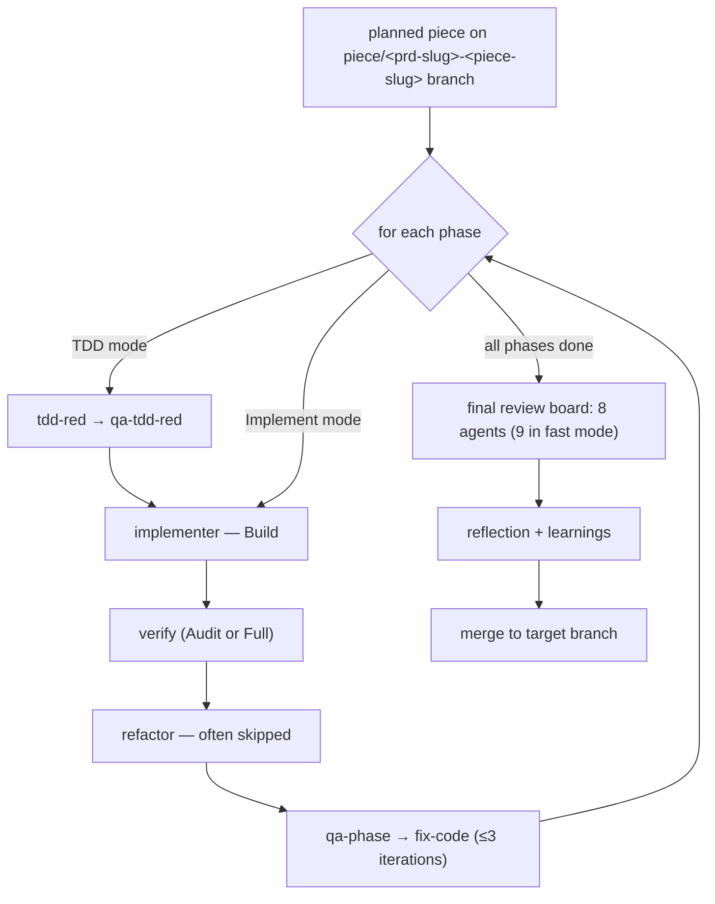

# /spec-flow:execute

Orchestrate implementation of an approved plan phase-by-phase. Each phase dispatches subagents (Red, Build, Verify, Refactor, QA), runs verification oracles, and advances only when gates pass. Ends with a final review board (8 agents in standard mode; 9 in fast mode) and a merge that follows the PRD's branching topology.

## What it does

The heaviest skill in spec-flow. Walks the plan from Phase 1 to Phase N, for each phase:

1. Dispatches the mode-appropriate agents (TDD or Implement track)
2. Runs the oracle (test suite for TDD, verify command for Implement)
3. Runs Phase QA (Opus adversarial review)
4. Advances to the next phase

At the end of the last phase, runs the Final Review board (8 agents; 9 in fast mode), produces a reflection, and merges the piece per the manifest's branching strategy.

## When to run it

- Piece status is `planned` in the manifest.
- You're on the piece's worktree branch (`piece/<prd-slug>-<piece-slug>`).
- All manifest dependencies are `merged`/`done` (or you pass `--ignore-deps` for transient-status deps).

It also handles **change-track** work: invoking `/spec-flow:execute change/<slug>` runs the same engine against a small-change brief + inline plan produced by `/spec-flow:small-change` (no manifest entry, no `specced`/`planned` gate).

## The flow at a high level



For the conceptual overview of what happens inside a phase, see [tdd-loop.md](../concepts/tdd-loop.md).

## Pre-flight: model check

Before anything else, execute verifies the active model is **Sonnet-class**. If it isn't, it blocks and prompts you to switch (or cancel). Sonnet is required because the orchestrator builds task lists, manages QA gates, parses AC matrices, tracks SHA manifests, and dispatches up to 9 review-board agents — Opus adds cost with no orchestration benefit; Haiku-class lacks the reasoning to route findings reliably.

## Pre-loop

Before phase 1 starts (fresh-start only):

- Updates the manifest **on the piece branch** to mark the piece `in-progress` (main keeps `planned` until merge/PR). Skipped on resume.
- Builds a harness task list (`TaskCreate` once, then `TaskUpdate` per phase). Progress is tracked via **both** the harness task list and plan.md checkboxes — neither alone is sufficient.

## Per-phase loop

For each phase in plan.md (skips phases where all checkboxes are `[x]`):

### Step 0a — Mid-piece Opus QA pass (≥6-phase pieces)

At the half-way phase boundary of a piece with 6 or more phases, the orchestrator dispatches a single Opus mid-piece QA pass over the work so far — a coarse net for AC gaps and cross-phase drift that per-phase QA (scoped to one diff) can't see. It fires once per piece, guarded against re-firing on resume via a session-state file and a marker commit.

### Step 1 — Capture phase-start SHA

Orchestrator records HEAD into working memory as `phase_N_start_sha`. No tag, no commit. Used later for test-integrity diffs.

### Step 1a — Detect phase mode

Reads the phase's checkboxes:

- Has `[TDD-Red]` → **Mode: TDD**
- Has `[Implement]`, no `[TDD-Red]` → **Mode: Implement**
- Both or neither → plan is malformed, escalate.

### Step 1b — Phase pre-flight

Orchestrator collects cheap facts the agents would otherwise rediscover:

- **LOC snapshot** — `wc -l` on each phase-scoped file.
- **Schema shape** — `head -20` of one sibling file if the phase writes a config family.
- **Symbol presence** — `git grep` for each named type/class/function the plan references.
- **Pre-commit hook inventory** — reads `.pre-commit-config.yaml`, flags test-running hooks.
- **Plan conditional resolution** — resolves LOC- and filesystem-based conditionals in the plan's Build/Implement block (e.g., "extract if function exceeds 200 LOC") into binding pre-decisions.

Attached to all subsequent agent prompts as `## Pre-flight snapshot` and `## Orchestrator pre-decisions` blocks.

### Step 2 — TDD-Red (TDD mode only)

- Skipped entirely when the plan's front-matter declares `tdd: false` (non-TDD mode).
- In TDD mode: dispatches **tdd-red** agent with the phase's `[TDD-Red]` tasks + spec ACs + pre-flight snapshot.
- Agent writes failing tests and stages them (does NOT commit — v2.7.0+).
- Orchestrator runs the test suite — expects failures for the *right reasons* (feature missing, not setup broken).
- Captures the verbatim failing output as `phase_N_oracle_block` — Step 3's oracle.
- Post-commit contamination check: reconciles the committed file list against the agent's `## Tests Written` paths to catch concurrent agent work sweeping in.

### Step 2.5 — QA-TDD-Red (TDD mode only)

- Between Red and Build, the **qa-tdd-red** agent reviews the just-authored tests for theater patterns — tautologies, mock-echo, truthy-only assertions, no-assertion tests, name/body mismatch, implementation coupling — and verifies adversarial AC binding. This catches weak tests *before* Build writes production code fit to pass them.
- FAIL re-dispatches Red once with the findings; a second failure escalates (the ACs are too vague or the `[TDD-Red]` block targets un-testable surface).
- **Skipped in fast mode** (`fast: true`) — the end-of-piece `verify Mode: Piece Full` board member compensates.

### Step 2.7 — Write-Tests (non-TDD mode only)

- For `tdd: false` pieces there is no Red. After Step 3 implements the code, an agent writes tests for the existing implementation (no fail-first, no theater review, no SHA manifest) and stages them for Verify.

### Step 3 — Implement (both modes)

- Dispatches **implementer** agent with `Mode: TDD` or `Mode: Implement` flag, the plan's Build/Implement block (by reference, not copy), pre-flight, pre-decisions, and the oracle.
- Agent writes code.
- Parallel phases: if the phase has `[P]` siblings, orchestrator dispatches them concurrently and checks for file-scope overlap on completion.
- **Validation:** runs the mode's oracle.
  - TDD mode: full test suite must be green.
  - Implement mode: the plan's `[Verify]` command must pass with expected output.
- **Circuit breaker:** 2 attempts max; then escalate.
- **AC Coverage Matrix gate:** In TDD mode, Build must return a complete matrix mapping each phase AC to a test file:line. A vague or incomplete matrix forces the next step into Full mode. In non-TDD mode (`tdd: false`), this gate is skipped — the matrix is not required, and Verify defaults to Full mode.

### Step 4 — Verify

- Dispatches **verify** agent in **Audit mode** (fast, ~3 min) if Build reported clean oracle + no deviations + clean matrix.
- Otherwise **Full mode** (~10 min) — re-runs the full oracle.
- **Test-integrity check (TDD mode only):** runs `git diff $phase_N_start_sha..HEAD -- tests/` and rejects the phase if tests were modified since Red. In non-TDD mode, this check is a no-op (no Red manifest exists).

### Step 5 — Refactor (often skipped)

- **Conditional skip:** auto-skipped when Build reported clean first-attempt oracle + no deviations + clean AC matrix. Empirically, Refactor on a clean Build fixes zero correctness defects and only produces cosmetic cleanups — skipping reclaims 10–15 min per phase with no quality loss.
- When run: **refactor** agent cleans up phase files, keeping tests green. Scope: phase files only. Cannot add functionality.

### Step 6 — Phase QA

- **qa-phase** agent (Opus) adversarially reviews the phase diff:
  - Diff + AC Coverage Matrix + phase ACs + non-negotiables.
  - **Not** the full spec or PRD — those are the final review board's job.
- Findings → **fix-code** agent makes targeted fixes → qa-phase re-reviews the delta.
- Up to 3 iterations, then escalate.

### Step 7 — Progress commit

Orchestrator commits a progress marker with the phase's checkboxes marked `[x]`. Ready for the next phase.

## End-of-piece flow

After the final phase:

### Final Review — board (8 agents; 9 in fast mode)

Eight reviewers dispatched **in parallel**, each with a specialized lens. In fast mode, a 9th reviewer (`verify Mode: Piece Full`) is added, compensating for the per-phase QA gates that fast mode skips:

| Reviewer | Focus |
|---|---|
| **blind** | Just the diff. Bugs, dead references, broken claims. |
| **edge-case** | Failure modes, stale caches, version floors, boundary conditions. |
| **spec-compliance** | Every AC honored? |
| **prd-alignment** | Advances PRD goals? Respects non-negotiables? |
| **architecture** | Layer boundaries, charter compliance, CR-xxx drift. |
| **security** | CWE Top 25, injection, crypto, auth/authz, supply chain, language-specific anti-patterns. |
| **ground-truth** | Do computed/measured outputs reproduce an independently-derived correct answer? Degenerate results, lookahead leakage, scope contamination, parity mismatch, silent truncation. |
| **integration** | Real wired path across each boundary; path coverage; mock-avalanche detection (over-mocked paths that suppress true integration failures). |

Findings resolved by fix-code/fix-doc, same 3-iteration cap.

### Reflection (optional)

Two reflection agents run (unless `reflection: off` in `.spec-flow.yaml`):

- **reflection-process-retro** — what worked / what didn't in the pipeline flow for this piece.
- **reflection-future-opportunities** — forward-looking candidates for future pieces or spec amendments.

Reflection agents **emit structured findings to the orchestrator; they do not write to any backlog directly**. Each finding is routed through Step 6c discovery triage where *you* choose amend / fork / defer. Only the `defer` choice writes to a backlog, and it does so through `/spec-flow:defer`: process-retro findings land in the global `docs/improvement-backlog.md`; future-opportunities findings land in the PRD-local `docs/prds/<prd-slug>/backlog.md`. There is no auto-accumulation.

### Merge

- Step 5.5 commits the terminal `status: merged` (+ `merged_at`) to the **piece branch** first — a mandatory gate before any push/PR, so the branch never reaches main as stale-active.
- Step 6 merges per `merge_strategy` in `.spec-flow.yaml`: `squash_local` (default) squash-merges the piece branch and cleans up the worktree; `pr` prints a `gh pr create` command for you to run (the skill never runs `gh` itself).
- The merge destination follows the manifest's branching topology, not always master: piece branches base off and merge to the PRD's `feature_branch:` when set, and the feature branch ships to `merge_target:` only when the full PRD is done.
- With Jira integration, tasks transition to Done (squash) or In Review (PR) automatically.

## Loops

- **Per-phase oracle loop** — 2 attempts max per implementation, then escalate.
- **Per-phase QA loop** — 3 iterations max per review cycle.
- **Final Review board loop** — 3 iterations max per finding set.

Every loop has a circuit breaker. No loop is unbounded.

## What you get

- Production code committed to the worktree branch, phase-by-phase.
- A clean git history showing each phase's progression.
- A `docs/prds/<prd-slug>/specs/<piece-slug>/learnings.md` file synthesized from the reflection findings plus the cumulative diff.
- Manifest flipped to `status: merged` on the piece branch.
- Piece merged (squash or PR) to its branch target with full review-board sign-off.

## Handoff

Next: `/spec-flow:status` tells you what's next. If there are more open pieces, pick one and run `/spec-flow:spec`.

## Worked example (high level)

Piece: `PI-104-data-export` with a 6-phase plan.

```
Phase 1 (Implement — schema):             2 min   clean
Phase 2 (TDD — auth):                     5 min   Red → Build (1 attempt) → Audit Verify → auto-skip Refactor → QA clean
Phase 3 (TDD — CSV writer):   [P] with 4: 6 min   clean
Phase 4 (TDD — JSON writer):  [P] with 3: 5 min   clean
Phase 5 (TDD — API endpoint):             11 min  Build needed 2 attempts; Full-mode Verify; QA found 1 must-fix (error-shape doesn't match CR-011); fix-code iter-2 clean
Phase 6 (Implement — docs):               3 min   clean

Final Review:                             8 min   8 agents parallel; prd-alignment flagged missing NN-P-003 dogfood citation; fix-doc added it; iter-2 clean

Reflection:                               4 min   process-retro noted "Phase 5's oracle retry was due to stale mock signature — pattern worth capturing"

Merge:                                    1 min   clean
```

Total: ~45 min of pipeline time. You signed off at every user-gate (spec, plan, final review). You didn't touch the code yourself.

## Common execute-time issues

- **Non-TDD mode, Verify stays in Full mode:** Without an AC Coverage Matrix, Verify cannot use the fast Audit mode. This is expected and correct — the Full mode is the right default when the matrix is absent.
- **Oracle won't turn green after 2 attempts** — escalated. Usually means the plan is ambiguous about what the code should actually do. Revise the plan, or add a missing acceptance criterion to the spec, and retry.
- **Test-integrity check fails** — the implementer modified test files. Rejected as cheating. Re-dispatch the Build with a stricter reminder; if it happens twice, escalate to check what's going on.
- **AC Coverage Matrix forces Full Verify** — happens when Build reports `NOT COVERED` without a reason. Build agent gets re-dispatched with the matrix requirements spelled out; if it still fails, escalate.
- **qa-phase loop won't clear** — 3 iterations hit. Means the fix agent can't resolve the finding with code changes alone. Likely a structural issue — maybe the plan missed a phase, or the spec's AC is ambiguous. Escalate.

## Where to go next

- [TDD loop concepts](../concepts/tdd-loop.md) — the per-phase cycle in detail, including non-TDD mode.
- [TDD vs Implement choosing](../concepts/tdd-loop.md#non-tdd-mode--the-piece-level-toggle) — when to use each mode.
- [QA loop concepts](../concepts/qa-loop.md) — how fix-and-re-review works.
- [Orchestrator model](../concepts/orchestrator-model.md) — the skill-vs-agent separation.
- [Pipeline concepts](../concepts/pipeline.md) — where execute sits in the full chain.
- [/spec-flow:small-change](./small-change.md) — the `change/<slug>` track execute also runs.
- [/spec-flow:review-board](./review-board.md) — run the end-of-piece board out of band.
- [/spec-flow:defer](./defer.md) — the sole write path for reflection/QA findings into backlogs.
